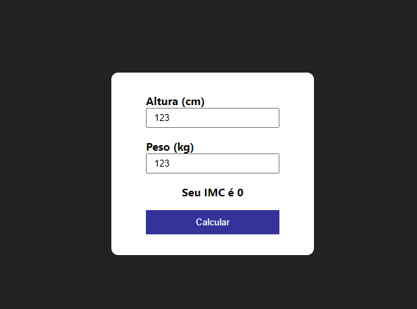

# Calculadora de IMC
*Atividade criada por Tiago Quadros*

## Objetivo
Aqui iremos criar um contador que poderá servir como uma ferramenta de pomodoro ou similar.

## Habilidades Esperadas
- Criar uma aplicação React com Vite
- Manipular estados
- Criar componentes
- Gerenciar eventos

## Como entregar a atividade?
As atividade devem ser enviadas em um arquivo zip, apenas com os seus códigos (as dependências podem ser reinstaladas apenas com o `package.json`).

[FORMULÁRIO PARA ENVIO](https://forms.gle/iJKx4yrXPouE5KpU8)

## Requisitos

### Criar a Estrutura Inicial
Crie um novo projeto React utilizando o Vite.
Configure o projeto conforme necessário, incluindo a instalação de quaisquer dependências adicionais.

### 2 - Criar os Componentes Básicos
Crie um componente para a entrada de dados, que inclua dois inputs: um para a altura (em metros) e outro para o peso (em quilogramas).
Crie um botão para iniciar o cálculo do IMC (você pode componentizar de uma forma mais detalhada caso deseje).

### 3 - Gerenciar Estados e Eventos
Garanta que os inputs estejam vinculados aos estados apropriados.
Garanta que o clique no botão de cálculo dispare a função de cálculo e atualize o estado do resultado do IMC.

### 4 - Criar a Lógica para o Cálculo do IMC
Crie uma função que calcule o IMC com base na fórmula: IMC = peso / (altura * altura).
Armazene o resultado do cálculo em um estado do componente.

### 5 - Exibir o Resultado
Crie um componente para exibir o resultado do IMC calculado.
Mostre uma mensagem ao usuário com o valor do IMC e uma interpretação básica (ex: abaixo do peso, peso normal, sobrepeso, etc.).

### 6 - Ao terminar o contador, execute algum aviso visual e/ou sonoro para o usuário.
Aqui você pode criar um aviso que seja, trocar a cor do fundo, disparar um alerta ou tocar algum efeito sonoro.
O contador não deve prosseguir após atingir zero.

### 7 - [BÔNUS] Faça a estilização condicional para alterar a cor conforme o nível de IMC.
Use cores como vermelho para obesidade, laranja para sobrepeso, verde para regular e azul para abaixo do regular.