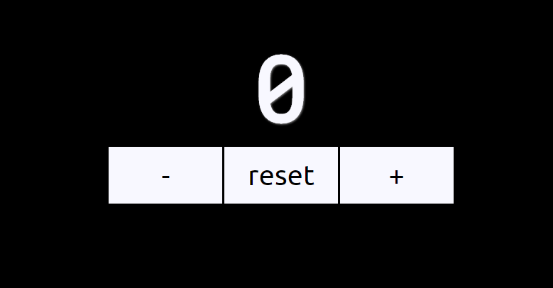

# API de Cachorros
*Atividade criada por Tiago Quadros*

## Objetivo
Aqui iremos criar um contador que poderá servir como uma ferramenta de pomodoro ou similar.

## Habilidades Esperadas
- Criar uma aplicação com Angular
- Assimilar os conceitos do Angular

## Como entregar a atividade?
As atividade devem ser enviadas em um arquivo zip, apenas com os seus códigos (as dependências podem ser reinstaladas apenas com o `package.json`).

[FORMULÁRIO PARA ENVIO](https://forms.gle/iJKx4yrXPouE5KpU8)

## Requisitos

### 1 - Criar a estrutura inicial.
Crie um novo projeto Vue.js.
Configure o projeto conforme necessário, incluindo a instalação de quaisquer dependências adicionais.

### 2 - Criar os Componentes Básicos
Crie um componente para o contador, dois botões para ajustar o contador e um botão para resetar o contador.

### 3 - Gerenciar Estados e Eventos
Garanta que o valor do contador esteja vinculado a um estado do componente e o clique nos botões de incremento e decremento atualize corretamente o valor do contador.

### 4 - [BÔNUS] Defina limites de máximo e mínimo
Garanta que os valores de incremento, inicial, máximo e mínimo sejam considerados nas operações de incremento e decremento.

### 5 - [BÔNUS] Exibir Mensagens de Aviso
Crie um componente para exibir mensagens de aviso quando o valor do contador atingir os limites máximo ou mínimo.

### 6 - [BÔNUS] Estilização Condicional
Faça a estilização condicional do contador para alterar a cor conforme o valor atual. Use cores como verde para valores positivos, vermelho para negativos, e azul para o valor zero.