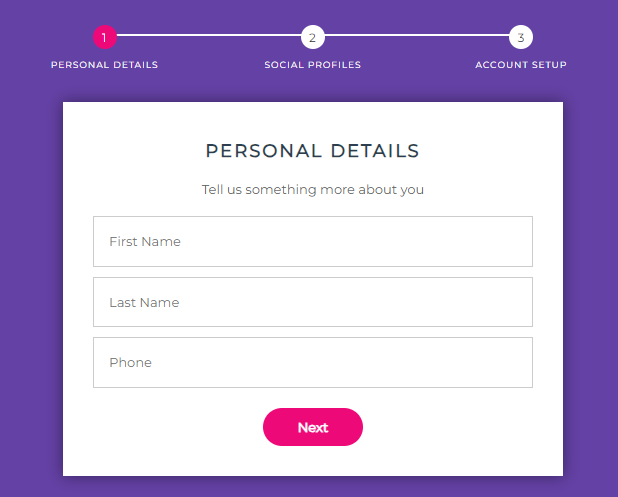

# Formulário de Contato
*Atividade criada por Tiago Quadros*

## Objetivo
Nesta aplicação, iremos criar um formulário de várias etapas.

## Habilidades Esperadas
- Compreender o uso de estados
- Compreender o ciclo de vida de componentes
- Dominar renderizações condicionais
- Dominar o uso de Redux Toolkit

## Como entregar a atividade?
As atividade devem ser enviadas em um arquivo zip, apenas com os seus códigos (as dependências podem ser reinstaladas apenas com o `package.json`).

[FORMULÁRIO PARA ENVIO](https://forms.gle/iJKx4yrXPouE5KpU8)

## Requisitos

### 1 - Criar a estrutura inicial.
Crie um novo projeto React utilizando o Vite. Não esqueça de instalar as dependências do Redux neste projeto.

### 2 - Configure o Redux Toolkit
Crie uma nova store e slice para gerenciar o estado do formulário de contato.

### 3 - Crie os componentes que representam as etapas do formulário
Crie componentes separados para cada etapa do formulário (ex: Step1, Step2, Step3).
- Na primeira etapa, precisamos ter apenas um campo para o nome.
- Na segunda etapa, precisamos ter apenas um campo para o e-mail.
- Na terceira etapa, precisamos ter apenas um campo para a idade.

### 4 - Valide as etapas
Garanta com que cada etapa só pode ser concluída, caso todos os campos sejam preenchidos. É interessante ter uma mensagem para avisar o usuário.

### 5 - Armazene os valores no Redux
Utilizando de dispatches, garanta que os valores sejam salvos no Redux durante cada etapa.

### 6 - Exibir o resultado final
Todos os valores devem aparecer ao final da terceira etapa.